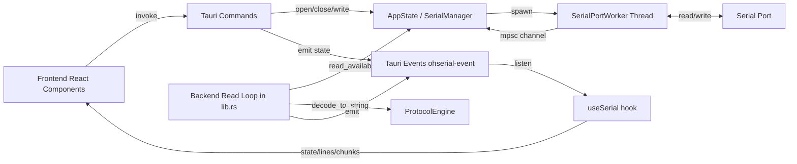
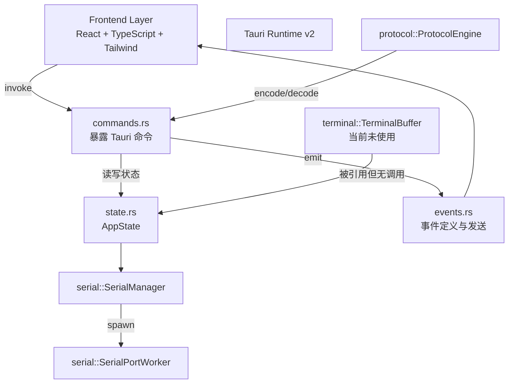
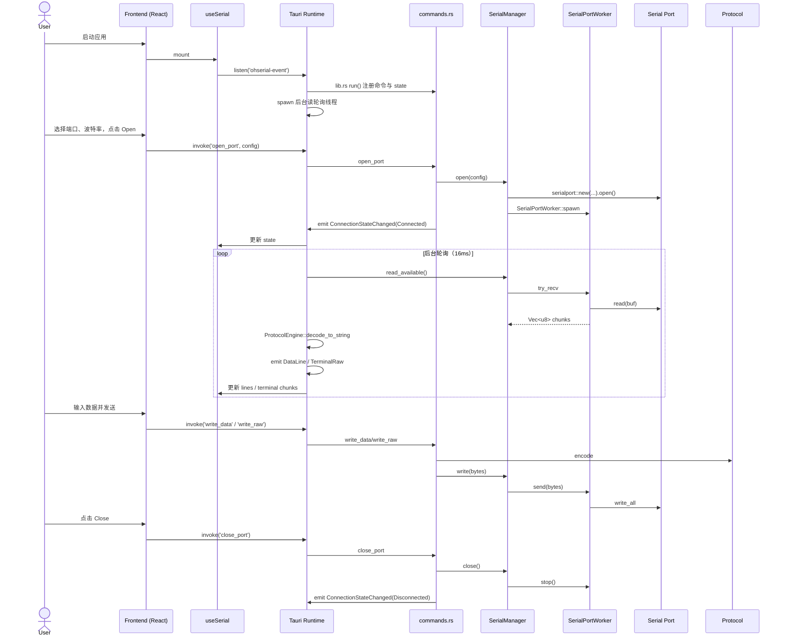
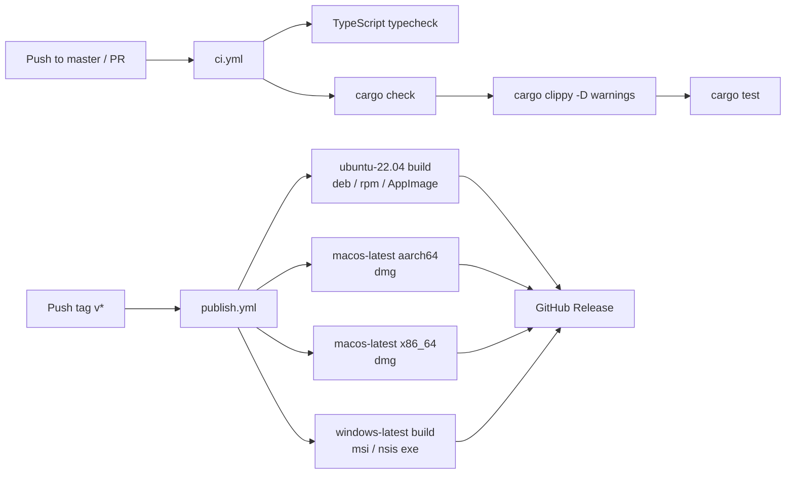

# OhSerial Program Notebook

> 中枢索引与项目状态。详细结构、数据流、代码风格等专题内容必要时拆分到 `docs/architecture/*.md`。

## 项目摘要

OhSerial 是一个跨平台 GUI 串口终端，基于 **Tauri v2 + Rust + React 19 + TypeScript**。

- 前端负责 UI 渲染与用户交互，通过 Tauri 命令/事件与后端通信。
- 后端负责串口 I/O、数据编解码、连接状态管理。
- 当前实现支持两种显示模式：Traditional Serial（按行日志）和 Virtual Terminal（基于 xterm.js 的 ANSI 终端）。
- 当前版本：`0.1.0`。

## 全局数据流摘要

- 写路径：`UI` → `invoke('write_data' / 'write_raw')` → `commands::write_data/write_raw` → `SerialManager::write` → `SerialPortWorker` → 串口。
- 读路径：`SerialPortWorker` 读取串口 → `mpsc` → `SerialManager::read_available` → 后端轮询线程 (`lib.rs`) → `ProtocolEngine::decode_to_string` → `AppEvent::DataLine` / `AppEvent::TerminalRaw` → 前端 `useSerial` → `RawLogView` / `TerminalView`。

## 架构摘要

- `commands.rs` 是前后端唯一命令边界，暴露 `list_serial_ports`、`open_port`、`close_port`、`write_data`、`write_raw`。
- `AppState` 通过 `.manage(...)` 在 Tauri 启动时注入，跨命令共享同一个 `SerialManager`。
- `SerialPortWorker` 在独立线程中阻塞/超时读取串口，并通过 `mpsc` 将数据发回主线程。
- `ProtocolEngine` 是无状态工具：编码（文本/Hex + 行尾），解码（UTF-8 lossy）。
- `terminal` 模块当前为**遗留/未使用代码**，详见[已验证缺陷](#已验证的实现缺陷与限制)。

## 程序运行流摘要

## 配置加载链

| 配置来源 | 位置 | 消费方 | 说明 |
|---|---|---|---|
| Tauri 应用配置 | `src-tauri/tauri.conf.json` | Tauri 构建/运行时 | 窗口尺寸、dev/build 命令、frontendDist、bundle 目标、能力文件引用 |
| 权限能力 | `src-tauri/capabilities/default.json` | Tauri 安全层 | 当前仅 `core:default` |
| 前端构建配置 | `vite.config.ts` | Vite dev/build | 端口 1420、HMR 端口 1421、路径别名 `@/`、忽略 `src-tauri` |
| Tailwind / UI 主题 | `tailwind.config.js`、`components.json`、`src/index.css` | 前端样式 | shadcn/ui 变量、深色主题、CSS variables |
| 串口连接参数 | `ConnectionPanel.tsx` 组件状态 | `useSerial` → `open_port` | 端口、波特率、数据位、校验、停止位；仅运行时由用户输入，无持久化 |
| Rust 依赖配置 | `src-tauri/Cargo.toml` | Cargo 构建 | `serialport`、`tauri`、`serde`、`chrono`、`thiserror` 等 |

- 当前没有外部持久化配置文件或环境变量读取链。
- 前端默认值（如波特率 115200）硬编码在 `ConnectionPanel.tsx`。

## CI/CD 流水线

| 工作流 | 文件 | 触发条件 | 职责 |
|--------|------|----------|------|
| CI | `.github/workflows/ci.yml` | push/PR 到 `master` | 前端 `tsc --noEmit`；后端 `cargo check` + `clippy` + `test` |
| 发布 | `.github/workflows/publish.yml` | 推送 `v*` 标签 | 四平台并行构建 `.deb`/`.rpm`/`.AppImage`/`.dmg`/`.msi`/`.exe`，自动创建 GitHub Release |

- CI 两个 job（`frontend` / `rust`）并行运行。
- 发布使用 tauri-apps/tauri-action，`tagName` 绑定 `${{ github.ref_name }}`。
- 无自动版本号 bump；发布前需手动更新 `src-tauri/tauri.conf.json` 的 `version` 并 push tag。

## 逐模块摘要

### 前端 (`src/`)

| 模块 | 文件 | 职责与要点 |
|---|---|---|
| 入口 | `src/main.tsx` | 创建 React root，渲染 `App`，引入 `index.css` |
| 根布局 | `src/App.tsx` | 模式切换（traditional/terminal）、组合 `ConnectionPanel`、`SendPanel`、`RawLogView`、`TerminalView`、`StatusBar` |
| 串口状态 hook | `src/hooks/useSerial.ts` | 维护 `ports`/`state`/`lines`/终端数据队列；轮询端口列表（1s）；监听 `ohserial-event`；提供 `openPort`/`closePort`/`writeData`/`writeRaw` 等命令包装 |
| 连接面板 | `src/components/ConnectionPanel.tsx` | 端口下拉/手动输入、波特率（可自由输入并带预设）、数据位/校验/停止位选择、Open/Close |
| 发送面板 | `src/components/SendPanel.tsx` | 仅在 Traditional 模式下显示；文本/Hex 模式、换行符选择、Enter 发送 |
| 原始日志 | `src/components/RawLogView.tsx` | 按行显示 `[timestamp] text`，自动滚动到底部 |
| 虚拟终端 | `src/components/TerminalView.tsx` | 基于 `@xterm/xterm` + `FitAddon`；接收 `Uint8Array` chunks；可选过滤清屏/交替屏幕 CSI 序列（`stripScreenClearingSequences`） |
| 状态栏 | `src/components/StatusBar.tsx` | 显示连接状态与端口/波特率 |
| UI 组件 | `src/components/ui/*` | shadcn/ui 原始组件：`button`、`input`、`select`、`toggle`、`card` |
| 工具函数 | `src/lib/utils.ts` | `cn()` 合并 Tailwind 类名 |
| 终端过滤器 | `src/lib/terminalFilter.ts` | 剥离 `ESC[?1047/1049/47 h/l`、`ESC[2J/3J/J`、`ESC[H` 等清屏/归位序列 |
| 类型 | `src/types.ts` | `SerialConfig`、`WriteRequest`、`ConnectionState`、`DataLine`、`TerminalCell`、`TerminalUpdate` |

### 后端 (`src-tauri/src/`)

| 模块 | 文件 | 职责与要点 |
|---|---|---|
| 二进制入口 | `src-tauri/src/main.rs` | 仅调用 `ohserial_lib::run()` |
| 库入口 | `src-tauri/src/lib.rs` | 注册 Tauri state、命令、启动后台读轮询线程；每 16ms 读取可用数据并发送事件 |
| 命令层 | `src-tauri/src/commands.rs` | `list_serial_ports`、`open_port`、`close_port`、`write_data`、`write_raw`；负责状态事件通知 |
| 应用状态 | `src-tauri/src/state.rs` | `AppState` 持有 `Arc<SerialManager>` 和 `Arc<Mutex<TerminalBuffer>>`（后者未使用） |
| 事件定义 | `src-tauri/src/events.rs` | `AppEvent` 枚举：`ConnectionStateChanged`、`DataLine`、`TerminalUpdate`、`TerminalRaw`；`emit_event` 辅助函数 |
| 错误类型 | `src-tauri/src/error.rs` | `AppError` / `AppResult`；包含串口、配置、解析等错误；可从 `serialport::Error`、`ParseIntError` 转换 |
| 串口配置 | `src-tauri/src/serial/config.rs` | `SerialConfig` 校验与映射到 `serialport` 的 DataBits/Parity/StopBits；含单元测试 |
| 串口管理 | `src-tauri/src/serial/manager.rs` | 维护 `config`、`worker`、`data_rx`；打开/关闭/写入/批量读取；使用 `Mutex<Option<...>>` |
| 串口工作线程 | `src-tauri/src/serial/worker.rs` | 在独立线程中读写串口；通过 `WorkerCommand` 接收写/停止指令；读错误（除 TimedOut）会停止自身 |
| 协议引擎 | `src-tauri/src/protocol/engine.rs` | `WriteRequest` 定义；文本/Hex 编码、行尾附加、UTF-8 lossy 解码；含单元测试 |
| 终端网格 | `src-tauri/src/terminal/buffer.rs`、`cell.rs` | 80×24 字符网格、`TerminalCell`、基础 ANSI 占位解析；当前未接入主数据流 |

## 参考资料索引

| 类型 | 路径 | 说明 |
|---|---|---|
| 使用说明 | `README.md` | 功能特性、开发命令、项目结构 |
| 前端依赖 | `package.json` | npm scripts、React/Tailwind/xterm 等依赖 |
| 后端依赖 | `src-tauri/Cargo.toml` | Rust crate 依赖 |
| Tauri 配置 | `src-tauri/tauri.conf.json` | 窗口、构建命令、bundle、能力 |
| 安全能力 | `src-tauri/capabilities/default.json` | 当前仅 `core:default` |
| 前端构建 | `vite.config.ts` | Vite + Tauri dev 专用端口/别名配置 |
| UI 配置 | `tailwind.config.js`、`components.json`、`src/index.css` | Tailwind / shadcn/ui 主题与变量 |
| CI 工作流 | `.github/workflows/ci.yml` | 前端 typecheck + 后端 cargo check/clippy/test |
| 发布工作流 | `.github/workflows/publish.yml` | `v*` tag 触发多平台构建发布 |

## 已验证的实现缺陷与限制

以下条目均来自当前源码搜索/文件读取，非推测。

1. **后端 `TerminalBuffer` 与 `TerminalUpdate` 为死代码**
   - `src-tauri/src/state.rs` 初始化了 `TerminalBuffer`，但没有任何代码读取或更新它。
   - `AppEvent::TerminalUpdate` 在 `src-tauri/src/events.rs` 中定义，但 `src-tauri/src/lib.rs` 的读轮询线程只发送 `DataLine` 和 `TerminalRaw`，从未发送 `TerminalUpdate`。
   - `src-tauri/src/terminal/` 模块仅被自身和 `state.rs` 引用，未接入主数据流。
   - 结论：`terminal/` 模块及 `TerminalUpdate` 相关类型当前是死代码。

2. **`ConnectionState::Connecting` 仅在前端本地使用**
   - `src/hooks/useSerial.ts` 的 `openPort` 会设置 `{ status: 'connecting' }`。
   - 后端 `events.rs` 的 `ConnectionState` 枚举包含 `Connecting`，但 `commands::open_port` 直接发送 `Connected`，没有任何命令/事件发送 `Connecting`。
   - 结论：连接中状态是前端本地 UX 状态，后端不参与。

3. **串口列表错误被静默吞掉**
   - `commands::list_serial_ports` 在 `serialport::available_ports()` 出错时返回空 `Vec`，前端会显示空列表而没有任何错误提示。

4. **串口读错误导致的断开没有通知前端**
   - `SerialPortWorker` 在 `port.read` 非 `TimedOut` 错误时会将 `running` 置为 `false` 并退出线程。
   - `lib.rs` 的读轮询对 `AppError::NotConnected` 静默 `continue`，对其它错误发送 `ConnectionStateChanged(Error)` 后关闭串口。
   - 但工作线程异常退出时，`SerialManager::read_available` 返回 `NotConnected`，主循环不会触发错误事件，前端会停留在 `Connected` 状态直到用户手动 Close。

5. **Content Security Policy 设为 `null`**
   - `src-tauri/tauri.conf.json` 中 `"csp": null`，未启用 CSP。当前前端为本地 Vite 构建资源，风险可控，但属于已知配置项。

---

*Notebook 创建时间：2026-06-27。上次更新：2026-06-29（新增 CI/CD 流水线章节）。后续每次结构性改动后应同步更新本文件或对应 `docs/architecture/*.md`。*
